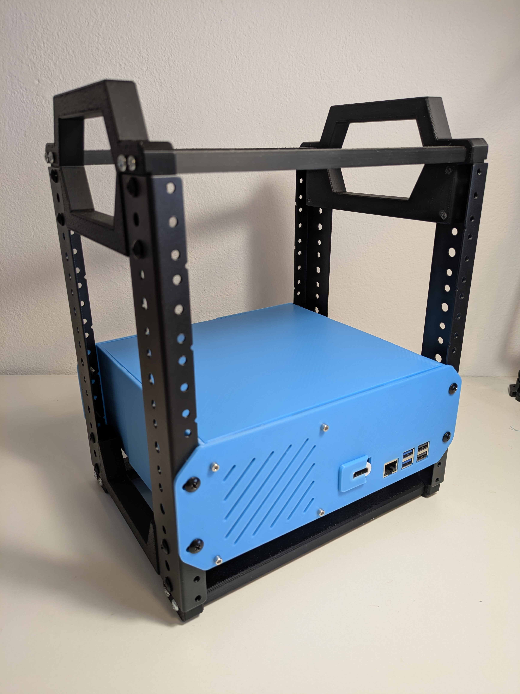

# 10" 2U Raspberry Pi 5 NAS with 6x 2.5" HDDs

A 3D-printed 2U enclosure for a Raspberry Pi 5 NAS running OpenMediaVault, designed to fit a 10" mini rack. Fits up to 6x 2.5" SATA drives connected through a 6-port M.2-to-SATA adapter while booting from an NVMe SSD. Both M.2 devices run on a single PCIe lane via a switch HAT.

## Specs

|                  |                                                          |
| ---------------- | -------------------------------------------------------- |
| **Compute**      | Raspberry Pi 5 8GB                                       |
| **Boot drive**   | 128GB M.2 2242 NVMe                                      |
| **Storage**      | 6x 1TB 2.5" SATA HDD (recycled from laptop SSD upgrades) |
| **PCIe HAT**     | Geekworm X1004 dual M.2 HAT (ASM1182e PCIe switch)       |
| **SATA adapter** | M.2 to SATA 6-port (ASM1166)                             |
| **Power**        | 5V 15A PSU + SATA splitter cables                        |
| **OS**           | OpenMediaVault                                           |
| **Rack**         | 3D-printed 10" mini rack with 6U steel rails             |

## 3D-printed parts

| Component                            | Printables                                                                                  | Source                                   |
| ------------------------------------ | ------------------------------------------------------------------------------------------- | ---------------------------------------- |
| Base chassis (2U, for 220x220mm bed) | [Printables](https://www.printables.com/model/1639121-10-2u-chassis-base-for-220x220mm-bed) | [`CAD/base-chassis/`](CAD/base-chassis/) |
| Drive box (6x 2.5")                  | [Printables](https://www.printables.com/model/1639132-6x-25-drive-box)                      | [`CAD/drives/`](CAD/drives/)             |
| NAS case (2U enclosed)               | <!-- TODO: upload to Printables -->                                                         | [`CAD/case/`](CAD/case/)                 |

All designs are FreeCAD projects with exported STLs. See [3D printing details](docs/3d-printing.md) for print notes, pending work, and third-party models used.

## Documentation

- [Bill of materials](docs/bom.md): full parts list with prices and links
- [Hardware alternatives](docs/hardware-alternatives.md): other hardware approaches explored (SATA HATs, USB, Compute Module)
- [Software](docs/software.md): OMV setup, boot fix for SATA controllers, other OSes tried
- [3D printing](docs/3d-printing.md): custom designs, STL inventory, third-party prints, reference models
- [References](docs/references.md): external links and resources

## License

[MIT](LICENSE)
